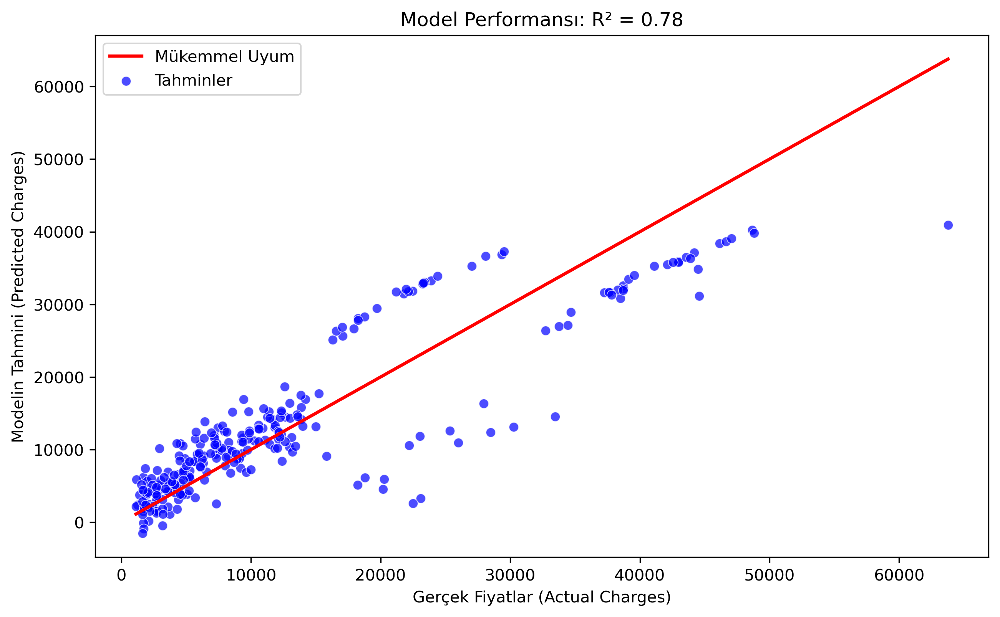

# 📊 Actuarial Python Lab

**"Where Actuarial Science meets Software Engineering."**

This repository serves as a digital laboratory where I implement actuarial formulas, statistical models, and risk calculations using Python. My goal is to bridge the gap between theoretical actuarial exams and real-world software applications.

## 🚀 Project Goals
- **Automate** standard actuarial calculations (Expected Loss, Premium Calculation, etc.).
- **Simulate** insurance risk scenarios using Python libraries.
- **Document** my journey of becoming an Actuary with a Software Engineering background.

## 🛠 Tech Stack
- **Language:** Python 3.x
- **Libraries:** NumPy, Pandas, Matplotlib (Coming soon)
- **Focus:** Insurance Analytics, Risk Modeling, InsurTech

---
*Author: Firdevs İslam*

---

## 🚀 Project 2: Insurance Premium Prediction (Machine Learning)

In this project, I built a **Linear Regression Model** to predict future insurance charges based on individual risk factors.

### 🎯 Goal
To transition from descriptive analytics to **predictive modeling** in the insurance domain using Scikit-Learn.

### 🛠️ Tech Stack
* **Python:** Pandas, NumPy
* **ML Library:** Scikit-Learn (Linear Regression)
* **Visualization:** Matplotlib, Seaborn

### 📊 Key Findings
* **Model Accuracy ($R^2$ Score):** 0.78 (The model explains 78% of the variance).
* **Top Risk Factors:** Smoking status and BMI showed the highest correlation with charges.
* **Result:** Successfully predicted insurance premiums with high accuracy using a linear approach.

### 📈 Model Performance
Below is the comparison between Actual Charges vs. Predicted Charges:

